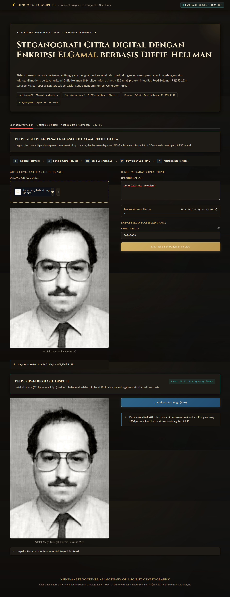
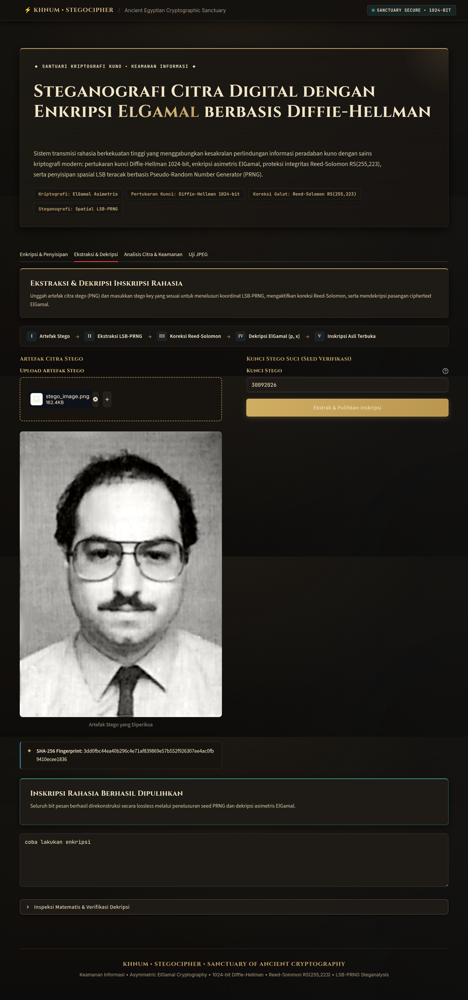

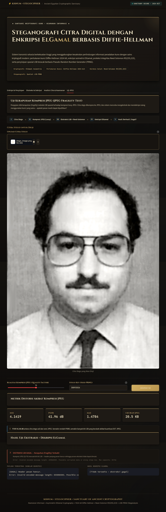

# Steganografi dengan Enkripsi ElGamal berbasis Diffie-Hellman

Aplikasi web berbasis **Streamlit** untuk pengamanan pesan rahasia pada citra digital menggunakan enkripsi asimetris **ElGamal berbasis Diffie-Hellman**, proteksi integritas **Reed-Solomon Error Correction**, serta penyisipan bit **LSB teracak berbasis PRNG**.

> **Ujian Tengah Semester Keamanan Informasi** — Semester 5

**Pembuat:**

- Muhammad Naufal Syifau Rahman (247006111059)
- Farhan Esha Putra Kusuma Atmaja (247006111066)
- Hafidz Januar Faturahman (247006111077)

---

## Fitur Utama

### 🔐 Enkripsi ElGamal berbasis Diffie-Hellman

- Pembangkitan **safe prime** (bilangan prima aman) sebagai modulus kriptografi
- Generate **key pair** (private key _x_ dan public key _y_) secara otomatis
- Enkripsi ElGamal menghasilkan pasangan ciphertext _(c₁, c₂)_ per byte
- Dekripsi menggunakan **private key** dan **modular exponentiation**

### 🛡️ Reed-Solomon Error Correction Code (ECC)

- Proteksi integritas data menggunakan skema **RS(255, 235)** dengan 20 parity symbols
- Auto-detection `nsym` untuk backward compatibility dengan stego image lama
- Error handling spesifik untuk kegagalan Reed-Solomon decoding

### 🖼️ Steganografi LSB dengan PRNG

- Penyisipan bit ke **Least Significant Bit (LSB)** piksel citra
- Posisi piksel **diacak** menggunakan PRNG (Pseudo-Random Number Generator) berbasis seed
- **Stego key** berfungsi sebagai seed PRNG; string non-numerik di-hash dengan SHA-256
- Kapasitas dihitung otomatis berdasarkan dimensi citra

### 📊 Analisis Citra & Steganalisis (Tab Analisis)

- Perbandingan visual Cover vs. Stego image
- **Metrik statistik**: MSE, PSNR, MAE, Korelasi
- **Perbandingan & perbedaan histogram** (frekuensi per kanal warna)
- **Enhanced LSB Plane** — visualisasi sebaran bit acak PRNG
- **Difference Heatmap** — peta spasial piksel yang dimodifikasi dengan amplifikasi
- **Steganalisis Chi-Square** (Westfeld & Pfitzmann Attack) — analisis probabilitas deteksi keberadaan pesan

### 🧪 Uji Kerapuhan JPEG (Tab Uji JPEG)

- Pengujian sifat **kerapuhan (fragility)** metode LSB spasial terhadap kompresi lossy JPEG
- Kompresi menggunakan berbagai **Quality Factor** (30–95)
- Menampilkan: citra stego vs. citra JPEG, metrik distorsi (MSE/PSNR/MAE), dan hasil ekstraksi
- Membuktikan bahwa kuantisasi koefisien DCT pada JPEG **merusak bit-bit LSB secara permanen**

---

## Struktur Proyek

```
.
├── app.py              # Antarmuka web Streamlit (4 tab: Enkripsi, Dekripsi, Analisis, Uji JPEG)
├── elgamal.py          # Implementasi algoritma ElGamal-DH
├── steganography.py    # LSB Steganography dengan PRNG dan Reed-Solomon ECC
├── analysis.py         # Fungsi analisis histogram, heatmap, chi-square, dan metrik statistik
├── requirements.txt    # Dependencies Python
├── clean_restart.sh    # Script bash untuk clean restart aplikasi
├── .gitignore          # Konfigurasi Git ignore
├── README.md           # Dokumentasi ini
├── tests/              # Suite pengujian otomatis
│   ├── test_1_full_encryption.py
│   ├── test_2_decryption.py
│   ├── test_3_capacity_limit.py
│   ├── test_4_wrong_stego_key.py
│   ├── test_5_image_analysis.py
│   ├── test_6_jpeg_compression.py
│   ├── run_all_tests.py
│   └── README.md
├── images/             # Gambar contoh penggunaan untuk dokumentasi
│   ├── contoh-penggunaan-enkripsi.png
│   ├── contoh-penggunaan-dekripsi.png
│   ├── contoh-penggunaan-analisis.png
│   └── contoh-penggunaan-ujiJPEG.png
├── dummy_steego_parameter.txt  # Parameter stego untuk testing
└── paragraf_dummy.txt  # Teks dummy 100 paragraf untuk testing kapasitas
```

---

## Instalasi

**1. Clone repositori:**

```bash
git clone https://github.com/Megatruh/Steganografi-dengan-Enkripsi-ElGamal-berbasis-Diffie-Hellman.git
cd Steganografi-dengan-Enkripsi-ElGamal-berbasis-Diffie-Hellman
```

**2. Install dependencies:**

```bash
pip install -r requirements.txt
```

## Menjalankan Aplikasi

```bash
streamlit run app.py
```

Aplikasi berjalan di `http://localhost:8501`

---

## Testing Suite

Proyek ini dilengkapi dengan suite pengujian otomatis untuk memverifikasi fungsionalitas semua fitur.

### Menjalankan Semua Test

```bash
python tests/run_all_tests.py
```

### Menjalankan Test Individual

```bash
# Test 1: Full Encryption
python tests/test_1_full_encryption.py

# Test 2: Decryption
python tests/test_2_decryption.py

# Test 3: Capacity Limit
python tests/test_3_capacity_limit.py

# Test 4: Wrong Stego Key
python tests/test_4_wrong_stego_key.py

# Test 5: Image Analysis
python tests/test_5_image_analysis.py

# Test 6: JPEG Compression
python tests/test_6_jpeg_compression.py
```

### Deskripsi Test

1. **test_1_full_encryption.py**: Menguji enkripsi penuh dengan parameter dari `dummy_steego_parameter.txt`, foto `Jonathan_Pollard.png`, stego key `30092026`, dan pesan "uji enkripsi"

2. **test_2_decryption.py**: Menguji dekripsi dari hasil test 1 untuk memverifikasi pesan dapat diekstrak dengan benar

3. **test_3_capacity_limit.py**: Menguji bahwa enkripsi gagal jika pesan melebihi kapasitas gambar (menggunakan `paragraf_dummy.txt`)

4. **test_4_wrong_stego_key.py**: Menguji bahwa dekripsi gagal jika stego key yang digunakan berbeda

5. **test_5_image_analysis.py**: Menguji semua fitur analisis gambar (histogram, heatmap, metrik statistik, chi-square, LSB plane)

6. **test_6_jpeg_compression.py**: Menguji efek kompresi JPEG pada steganography dengan berbagai quality level

Untuk dokumentasi lengkap testing, lihat `tests/README.md`

---

## Cara Penggunaan

### Tab 1 — Enkripsi & Penyisipan



1. Upload **gambar cover** (PNG/JPG/BMP)
2. Masukkan **pesan rahasia** (plaintext)
3. Masukkan **stego key** (seed PRNG, default: `12345`)
4. Klik **"Enkrip & Sembunyikan Pesan"**
5. Aplikasi akan:
   - Mengenkripsi pesan dengan **ElGamal** → _(c₁, c₂)_
   - Melindungi payload dengan **Reed-Solomon ECC**
   - Menyisipkan bit ke piksel acak menggunakan **LSB-PRNG**
   - Menampilkan gambar stego + nilai **PSNR**
6. **Download** gambar stego dalam format **PNG (lossless)**

> ⚠️ Simpan dalam format PNG — jangan dikonversi ke JPEG sebelum ekstraksi.

### Tab 2 — Ekstraksi & Dekripsi



1. Upload **gambar stego** (hasil dari Tab 1)
2. Masukkan **stego key yang sama**
3. Klik **"Ekstrak & Dekripsi Pesan"**
4. Aplikasi akan mengekstrak bit LSB → koreksi error RS → dekripsi ElGamal → tampilkan plaintext

### Tab 3 — Analisis



Tersedia setelah melakukan enkripsi di Tab 1. Menampilkan:

- Perbandingan visual cover vs. stego
- Metrik kualitas (MSE, PSNR, MAE, Korelasi)
- Histogram perbandingan dan selisih frekuensi
- Enhanced LSB Plane & Difference Heatmap
- Steganalisis Chi-Square (Westfeld Attack)

### Tab 4 — Uji Kerapuhan JPEG



1. Upload gambar cover
2. Masukkan pesan uji dan pilih **quality factor** JPEG
3. Klik **"Jalankan Uji Kerapuhan JPEG"**
4. Lihat bagaimana kompresi JPEG merusak bit LSB dan mencegah ekstraksi pesan

---

## Pipeline Kriptografi

```
Plaintext
   │
   ▼
ElGamal Encrypt (c₁, c₂)
   │
   ▼
Reed-Solomon ECC Encode (+20 parity bytes)
   │
   ▼
LSB-PRNG Embed (posisi acak berbasis stego key)
   │
   ▼
Citra Stego (PNG)
```

---

## Teknologi

| Library      | Versi Min | Fungsi                        |
| ------------ | --------- | ----------------------------- |
| `streamlit`  | ≥ 1.39.0  | Framework web UI              |
| `Pillow`     | ≥ 10.0.0  | Pemrosesan citra              |
| `numpy`      | ≥ 1.24.0  | Komputasi numerik array       |
| `matplotlib` | ≥ 3.7.0   | Visualisasi histogram & plot  |
| `reedsolo`   | ≥ 1.7.0   | Reed-Solomon Error Correction |

---

## Catatan Keamanan

- **Private key** disimpan di session state Streamlit dan tidak dipersistenkan ke disk
- **Stego key** wajib diingat — tanpa key yang sama, pesan tidak dapat diekstrak
- ElGamal menggunakan **safe prime** dan generator yang aman secara kriptografis
- Pengacakan posisi LSB berbasis PRNG meningkatkan resistensi terhadap steganalisis sederhana
- Metode LSB spasial **bersifat rapuh (fragile)** terhadap kompresi lossy (JPEG) — gunakan PNG
